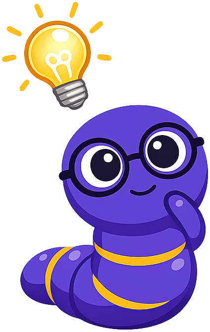
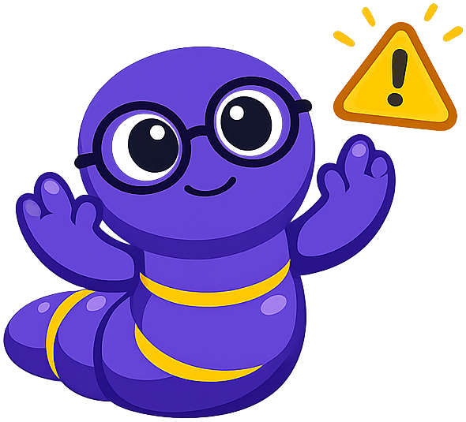

# Foundations of English Language Arts

## Summary

This chapter establishes the conceptual framework for the entire course. Readers are introduced to the structure of the Common Core ELA standards, the five ELA strands, and the College and Career Readiness (CCR) anchor standards that define the goals of high school literacy. Foundational reading skills — close reading, textual evidence, text complexity, and Lexile levels — are introduced alongside the vocabulary tools (academic and domain-specific vocabulary) that will support every subsequent chapter.

## Concepts Covered

This chapter covers the following 14 concepts from the learning graph:

1. English Language Arts Overview
2. Common Core ELA Standards
3. College and Career Readiness
4. Grades 9-10 Standards Band
5. Grades 11-12 Standards Band
6. Five ELA Strands
7. CCR Anchor Standards
8. Close Reading
9. Textual Evidence
10. Text Complexity
11. Lexile Level
12. Independent Reading
13. Academic Vocabulary
14. Domain-Specific Vocabulary

## Prerequisites

This is the first chapter. It assumes only the prerequisites listed in the [course description](../../course-description.md).

---

Reading is not a passive act — it is one of the most powerful things a human being can do. When you learn to read carefully, question what you encounter, and evaluate what an author is actually doing, you develop a skill that most adults never fully acquire: the ability to understand, analyze, and respond to almost any text placed before you, from a Supreme Court opinion to a news headline to a poem written four centuries ago. That is the promise of English Language Arts. Not grammar worksheets and five-paragraph essays alone — though those have their place — but a set of interrelated skills that make you a sharper thinker, a more persuasive writer, and a reader who is genuinely hard to fool.

This chapter builds the foundation for everything that follows. You will learn how the Common Core ELA standards are organized and why that organization matters, what the five strands of ELA are and how they work together as a system, and what College and Career Readiness actually means in practice. You will learn what close reading looks like when it is done well, how to find and use textual evidence, how to understand text complexity and Lexile levels, and how to build the academic vocabulary that makes reading harder texts possible. Every concept introduced here returns, deepened and applied, throughout the rest of this book.

!!! mascot-welcome "Hello, Readers — I'm Pip!"
    
    Welcome to *English Language Arts*! I'm **Pip**, a bookworm — literally — and I'll be with you from this first chapter all the way through your capstone project. I pop up throughout this book, but I don't appear randomly. I have **six jobs**, and you will learn to recognize me by which one I'm doing:

    1. **Welcome you** at the start of every chapter — that's what I'm doing right now.
    2. **Help you think** when a concept is the kind that unlocks everything else — I'll appear with a key idea worth pausing on.
    3. **Share a tip** — the practical move that expert readers and writers make that nobody thinks to write down.
    4. **Warn you** about the spots where even careful students make the same mistake. Forewarned is forearmed.
    5. **Encourage you** when the material gets genuinely hard — because some of it will, and slowing down is exactly the right response.
    6. **Celebrate with you** at the end of each chapter when you've done the work and earned it.

    That's it! *Let's read between the lines!*

## What English Language Arts Actually Is

The phrase "English Language Arts" can sound like a bureaucratic umbrella for everything that happens in English class. But the name is precise. "Language" refers to the study of how words work — grammar, vocabulary, syntax, the conventions that allow communication to be clear and effective. "Arts" signals that reading and writing are not mechanical processes but creative and analytical ones that require judgment, interpretation, and sustained practice. Together, English Language Arts names a discipline organized around one central question: how do humans use written language to communicate, persuade, inform, and create — and how do you become someone who can do all of that with skill?

In the United States, the content of high school ELA courses is shaped by the **Common Core State Standards (CCSS)**, a framework of educational benchmarks developed through a national initiative led by the **National Governors Association Center for Best Practices (NGA)** and the **Council of Chief State School Officers (CCSSO)**. Released in 2010, the Common Core ELA standards were designed to answer a practical question: what knowledge and skills do students need in order to succeed in college and in meaningful careers after high school? The standards were built through extensive research on what colleges and employers actually require — not what educators hoped students would know, but what post-secondary institutions and workplaces confirmed was genuinely necessary.

It is worth being clear about what the Common Core standards are and what they are not. They are a framework of expected outcomes — what students should be able to do by the end of each grade band. They are not a curriculum, a required reading list, or a set of lesson plans. Individual districts, schools, and teachers decide how to teach toward these outcomes. Two students in different states, using entirely different textbooks and reading different books, can both be working toward exactly the same standards. What you learn in this course is tied to those standards, which means that what you learn here has been validated as genuinely useful for the next step in your education and your working life.

At the heart of the Common Core ELA framework is a concept called **College and Career Readiness (CCR)**. This phrase appears throughout the standards as a benchmark — the level of literacy that, if achieved, prepares you to enter a college-credit course or a skilled workplace training program without needing remediation. CCR is not a minimum floor; it is a meaningful target. Being college and career ready means you can read complex texts independently and understand them, write clearly and persuasively for real audiences, conduct research using reliable sources, discuss ideas in structured settings, and use language with enough control and precision to communicate effectively in formal contexts. These are not abstract skills. They are measurable, teachable, and absolutely achievable — and this book is designed to help you develop every one of them.

One thing the CCR framework makes explicit is that reading and writing are not separate from the rest of your life. Every college course, regardless of subject, will ask you to read texts of significant complexity and respond in writing. Every professional field — from healthcare to engineering to law to business — requires workers who can read critically, communicate precisely, and evaluate information for credibility and relevance. The skills you are developing in this course compound over time. A student who graduates having mastered close reading, evidence-based writing, and source evaluation is not just prepared for an English exam — they are prepared for a world saturated with information, where the ability to distinguish reliable from unreliable and strong argument from manipulative rhetoric is genuinely rare and genuinely valuable.

## The Five Strands and the Standards That Guide Them

The Common Core ELA standards are organized into five **strands** — five interconnected areas of literacy that together form a complete picture of what it means to be a skilled reader, writer, speaker, and thinker. Before exploring each strand, it helps to understand why a five-strand structure exists at all. The designers of the Common Core recognized that reading, writing, speaking, listening, and language are not isolated skills — they reinforce each other constantly. A student who reads widely becomes a better writer. A student who practices speaking ideas aloud becomes a more precise thinker. A student who develops a rich vocabulary becomes a sharper reader. The five-strand framework captures this interconnection by treating ELA as a unified system rather than a collection of unrelated subjects.

Here is what each strand covers:

- **Reading: Literature** develops your ability to read, analyze, and interpret fiction, poetry, drama, and other literary texts. This strand covers identifying and tracing themes, analyzing how an author's word choices shape meaning and tone, and comparing multiple interpretations of the same work. You will read works from American and world literary traditions, including Shakespeare, poetry from multiple periods, and contemporary fiction and memoir.

- **Reading: Informational Text** builds your skills for reading nonfiction — arguments, historical documents, scientific and technical texts, journalism, and digital content. This strand emphasizes identifying a central idea, analyzing how an author supports claims with evidence, evaluating the quality of reasoning, and comparing texts that address the same topic from different perspectives. The US foundational documents — the Declaration of Independence, the Federalist Papers, Lincoln's second inaugural address — are a particularly important part of this strand.

- **Writing** develops three modes of writing: argumentative (making a claim and supporting it with evidence and reasoning), informative/explanatory (conveying complex ideas clearly and accurately), and narrative (using storytelling techniques to develop real or imagined experiences). The writing strand also covers the writing process — planning, drafting, revising, editing, publishing — and research skills, including how to gather, evaluate, and cite sources correctly.

- **Speaking and Listening** covers the skills of structured academic discussion and formal presentation. This includes preparing for and contributing to discussions, responding substantively to others' ideas, evaluating a speaker's reasoning and use of evidence, and delivering organized, well-supported oral presentations adapted to audience and purpose.

- **Language** addresses the conventions of standard English — grammar, usage, punctuation, capitalization, and spelling — along with vocabulary acquisition and effective language use. This strand is not about following rules for their own sake; it is about understanding how language choices create meaning and effect. A writer who understands syntax can make deliberate choices that a writer who merely follows rules cannot.

!!! mascot-thinking "Five Strands — One System"
    
    Here is the concept worth sitting with: the five strands are not a list of separate subjects — they are one system. Every time you write an argument, you are drawing on your reading. Every time you give a presentation, you are using your language skills. Getting better at any one strand makes you better at all of them. That is not an accident — it is how literacy works.

Before we examine the diagram below, two terms need to be clear. A **strand** is one of the five major areas of ELA study; think of it as a category of skill. An **anchor standard** is one of the ten overarching goals within a strand that defines what College and Career Readiness looks like in that area. The anchor standards are the targets; the grade-level standards are the milestones along the road to reaching them.

#### Diagram: The Five ELA Strands — Interactive Overview


<iframe src="../../sims/five-ela-strands/main.html" width="100%" height="482px" scrolling="no"></iframe>
[Run The Five ELA Strands — Interactive Overview Fullscreen](../../sims/five-ela-strands/main.html)

<details markdown="1">
<summary>The Five ELA Strands — Interactive Overview</summary>
Type: diagram
**sim-id:** five-ela-strands<br/>
**Library:** Mermaid<br/>
**Status:** Specified

**Learning objective:** Recall the five ELA strands and explain how they form an interconnected system (Bloom Level 2 — Understand: explain, classify).

**Diagram description:** A top-down flowchart with "English Language Arts" as the root node branching to five strand nodes (Reading: Literature, Reading: Informational Text, Writing, Speaking & Listening, Language). Each strand node branches to one child node showing its primary focus. All nodes are clickable.

**Click behavior:** Clicking any node opens an infobox (a styled div or modal overlay) containing: (1) the strand name as a heading, (2) a 2-3 sentence description of what the strand covers, and (3) one example skill or task from that strand. The infobox closes when the user clicks anywhere else on the canvas. This is the only interaction required.

**Node styling:**
- Root node (ELA): filled with indigo (#3f51b5), white text, rounded rectangle
- Five strand nodes: filled with medium blue (#5c6bc0), white text, rounded rectangle
- Child detail nodes: filled with light blue (#e8eaf6), dark text, rounded rectangle
- All nodes: border radius 8px, subtle drop shadow

**Mermaid code (starter — implement with JavaScript click handlers, not Mermaid-native click directives if browser support is limited):**

```
graph TD
    ELA["English Language Arts"] --> RL["Reading: Literature"]
    ELA --> RI["Reading: Informational Text"]
    ELA --> W["Writing"]
    ELA --> SL["Speaking & Listening"]
    ELA --> L["Language"]
    RL --> RL1["Fiction, Poetry, Drama, Literary Analysis"]
    RI --> RI1["Arguments, Documents, Nonfiction, Media"]
    W --> W1["Argumentative · Informative · Narrative"]
    SL --> SL1["Discussion, Presentation, Media Evaluation"]
    L --> L1["Grammar, Vocabulary, Conventions, Style"]
    click ELA "javascript:showInfo('ELA','English Language Arts is an integrated system of five strands. Growth in any one strand strengthens all the others — reading widely makes you a better writer; writing regularly makes you a sharper reader.')"
    click RL "javascript:showInfo('Reading: Literature','This strand develops your ability to analyze fiction, poetry, drama, and foundational literary works for theme, craft, structure, and meaning. You will read works from American and world literary traditions, including Shakespeare and contemporary authors.')"
    click RI "javascript:showInfo('Reading: Informational Text','This strand builds skills for reading nonfiction: arguments, historical documents, scientific and technical texts, journalism, and digital sources. The US founding documents — Declaration, Federalist Papers, Gettysburg Address — are central texts.')"
    click W "javascript:showInfo('Writing','This strand covers three modes — argumentative, informative/explanatory, and narrative — plus the full writing process (plan, draft, revise, edit, publish) and research skills including source evaluation and citation.')"
    click SL "javascript:showInfo('Speaking & Listening','This strand develops structured academic discussion, oral presentation, and critical evaluation of speakers and media. You will practice both contributing substantively to discussions and listening analytically to others.')"
    click L "javascript:showInfo('Language','This strand covers the conventions of standard English (grammar, usage, punctuation, spelling) and sophisticated vocabulary acquisition — not rules for their own sake, but as tools for making deliberate, effective language choices.')"
```

**Implementation note:** The `showInfo(title, text)` function should display a styled overlay div in the upper right of the Mermaid container, populated with the title and text, with a close button. The overlay should be dismissible by clicking anywhere outside it. The container div must handle resize events so the diagram reflows at all viewport widths.

**Canvas size:** Responsive, minimum 600px wide, height auto-adjusts to content.
</details>

Spanning across all five strands are the **CCR Anchor Standards** — ten overarching goals per strand that define what college and career readiness looks like in each area. These anchor standards are the targets that every grade-level standard works toward. For example, the first anchor standard in Reading states that students should be able to "read closely to determine what the text says explicitly and to make logical inferences from it; cite specific textual evidence when writing or speaking to support conclusions drawn from the text." This is not a skill you master once and set aside — it is a practice that deepens every time you apply it to a more demanding text.

The Common Core addresses high school in two **grade bands** rather than individual grade levels. These bands — **grades 9–10** and **grades 11–12** — reflect the understanding that literacy development is not a year-by-year lockstep process. Students grow at different rates, and a two-year band allows teachers and students to work toward increasingly sophisticated goals without treating development as uniform. The table below illustrates how expectations grow from the 9–10 band to the 11–12 band across several key areas:

| Area of Growth | Grades 9–10 | Grades 11–12 |
|---|---|---|
| Text complexity | Read and comprehend literary and informational texts in the grades 9–10 text complexity band with scaffolding as needed | Read and comprehend at the high end of the grades 11–CCR text complexity band independently and proficiently |
| Textual evidence | Cite strong and thorough textual evidence to support analysis of explicit and inferential meaning | Cite strong and thorough evidence, including inferences not explicitly stated, and acknowledge when the text leaves matters uncertain |
| Argument writing | Introduce a precise claim, distinguish the claim from counterclaims, and use a logical organizational structure | Introduce a precise, knowledgeable claim, establish its significance, and anticipate and respond to counterclaims fairly |
| Research | Conduct short and sustained research projects to answer a question, drawing on multiple sources | Gather relevant information from multiple authoritative sources and synthesize multiple perspectives into a coherent argument |
| Vocabulary | Determine the meaning of words and phrases using context clues, morphology, and reference materials | Apply knowledge of language to understand how language functions in different contexts, make effective meaning choices, and achieve precision |

This progression is not about covering the same material twice at a higher difficulty setting. It is about developing judgment — the ability to make increasingly sophisticated interpretive, analytical, and rhetorical decisions independently, with less scaffolding and more confidence.

### The CCR Anchor Standards: What the Targets Actually Say

The grade-band table above shows the trajectory of growth across high school. But what are the actual targets? Each of the five ELA strands contains ten **CCR Anchor Standards** — statements describing what a fully prepared graduate can do in that area. Together, the fifty anchor standards across all five strands form a complete picture of high school literacy.

Here is a representative sample from the Reading anchor standards, since reading is the thread that connects every chapter in this book:

**Reading Anchor Standard 1** asks that readers "read closely to determine what the text says explicitly and to make logical inferences from it; cite specific textual evidence when writing or speaking to support conclusions drawn from the text." This standard is the backbone of close reading — and it appears in every reading assignment, every analytical essay, and every academic discussion you will have in this course. It is the standard this entire chapter is organized around.

**Reading Anchor Standard 6** asks that readers "assess how point of view or purpose shapes the content and style of a text." This is the standard behind rhetorical analysis — understanding that every author is a person with a position, a purpose, and an audience, and that those factors shape every sentence they write. A news article about immigration written for a policy journal looks and argues differently than one written for a community newspaper. A skilled reader can identify those differences and explain why they exist, rather than treating all texts as neutral conveyors of information.

**Reading Anchor Standard 8** asks that readers "delineate and evaluate the argument and specific claims in a text, including the validity of the reasoning as well as the relevance and sufficiency of the evidence." This is the standard that connects ELA to critical thinking, logic, and source evaluation. It is the skill that allows a reader to recognize when an argument is sound and when it is persuasive but misleading — a distinction that matters enormously in an era of sophisticated misinformation.

The Writing anchor standards are equally revealing. **Writing Anchor Standard 1** asks that writers "write arguments to support claims in an analysis of substantive topics or texts, using valid reasoning and relevant and sufficient evidence." Notice that the anchor standard does not ask writers to have an opinion — it asks them to construct an argument. The difference is significant. An opinion is a starting point; an argument is a structured claim supported by reasoning and evidence that can withstand scrutiny. Every argument essay you write in this course is practice at that standard.

**Writing Anchor Standard 9** asks that writers "draw evidence from literary or informational texts to support analysis, reflection, and research." This anchor standard is why close reading and writing are inseparable in this course. You cannot write a strong analytical essay about a text you have only glanced at; the evidence you need lives in the details — the word choices, the structure of sentences, the patterns of repetition — all of which close reading surfaces. The anchor standard formalizes what good writers have always known: analysis grows from attention.

Understanding the anchor standards gives you something practical: it tells you what you are working toward in any given assignment. When a teacher asks you to "analyze the author's purpose," that task is connected to a specific anchor standard, which is connected to a College and Career Readiness goal. The assignment is not arbitrary — it is a step toward a capability that will matter after high school. Knowing that makes the work more meaningful. You are not learning to analyze a text for the sake of a grade. You are building a skill that experts in every field rely on.

## Close Reading — The Skill That Changes Everything

Of all the skills this course develops, close reading is the most foundational. Everything else — argumentation, textual evidence, source evaluation, rhetorical analysis, research — depends on your ability to read carefully, slowly, and purposefully. Most reading you do every day is transactional: you scan a text for what you need and move on. Close reading is different. It is the practice of returning to a text multiple times, paying attention to how it is constructed, and asking not just what the text says but how and why it says what it says.

Close reading is not about uncovering hidden meanings that only teachers can see. It is a systematic practice, and like any practice, it improves with use. Three moves define close reading at the high school level:

**First reading — Get the gist.** Read through the passage completely without stopping to annotate. Your goal is a basic orientation: who is speaking or being described, what is happening, what the central idea appears to be. Don't be troubled if you don't understand everything. A first read is just the beginning, and confusion is information — it tells you exactly where to return.

**Second reading — Annotate for structure and language.** Go back slowly. Mark unfamiliar words. Circle or underline phrases that seem significant, surprising, or strange. Notice where the author shifts direction, tone, or focus. Ask questions in the margins: *Why does the author choose this word here? What is being compared? Who is the intended audience? What is being assumed rather than stated?* Pay attention to patterns — repeated words or images, shifts in sentence length, changes in the level of formality.

**Third reading — Analyze the author's choices.** With your annotations in front of you, zoom out. What has the author done, and why? How does the structure of the text contribute to its effect? What would be lost if a key word or phrase were replaced by a near-synonym? How does the opening of the text connect to its close? This is the level at which analysis happens — and it is the level this course will consistently ask you to work at.

### Building an Annotation System That Works

The three-move framework describes what close reading does at a conceptual level. For it to work in practice, you need a concrete annotation system — a consistent set of marks, symbols, and notes you apply as you read. Strong annotators develop their own systems over time, but the following categories cover the most important features to track in high school ELA reading:

**Vocabulary:** Circle words you don't know on the first pass, then return to them on the second read using a dictionary or context clue strategy. Write the meaning in the margin in your own words — not the dictionary's definition verbatim, but what the word means in this specific sentence. The difference between copying a definition and writing your own paraphrase is the difference between passive recording and active understanding.

**Key phrases:** Underline or bracket phrases that carry the most meaning — the moments where an author lands an important idea, makes a surprising turn, or uses language with particular precision or force. When you write an analytical essay later, these are the quotations you will return to. Marking them as you read saves you the work of hunting through the text a second time and ensures that you notice them while the text is freshest.

**Structural signals:** Mark places where the text changes direction: a new argument begins, time shifts, a speaker changes, a counterargument appears, a tone darkens or lightens. In a multi-paragraph text, tracking where the author pivots — and why — reveals the architecture of the argument or narrative. In an essay, these structural moves are as significant as the ideas themselves. A writer who introduces a counterargument at paragraph four rather than paragraph two has made a deliberate rhetorical choice; a close reader notices it.

**Questions:** Write genuine questions in the margins — not just "What does this mean?" but specific questions that arise from specific moments in the text. "Why does the author introduce this character at this point rather than earlier?" or "What is the source for this claim?" or "Who exactly is meant by 'we' in this sentence?" Questions are one of the most powerful forms of engagement because they commit you to seeking an answer rather than passively receiving information. A margin full of questions is a sign of deep reading, not confusion.

**Connections:** Note moments when the text connects to something else you know — another text you have read, a historical event, a current news story, your own experience, a concept from another class. These connections are not distractions from the text; they are how knowledge integrates. The reader who connects Jefferson's claim about "unalienable rights" to a contemporary civil liberties debate is reading at a deeper level than the reader who treats the Declaration as a sealed historical artifact with no bearing on the present.

One practical note: both physical and digital annotation work, but they work differently. A pencil in a printed text gives you maximum flexibility — you can mark anywhere, draw arrows between ideas, and see the entire annotated page at a glance. Digital highlighting and notes in reading apps are more portable but often harder to survey. Some readers print digital texts specifically to annotate on paper, an inconvenience that pays for itself in comprehension and retention. Whatever medium you use, develop the habit of marking actively. A text you have annotated is a text you have read; a text with no marks is a text you have only looked at.

### Working with Textual Evidence

Close reading and textual evidence are inseparable skills. **Textual evidence** is any direct quotation, paraphrase, or specific reference from a text that you use to support a claim about that text's meaning, structure, or effect. Making the distinction between observation and evidence-supported analysis is one of the most important moves in high school ELA.

Saying "the author sounds angry in this passage" is an observation — possibly accurate, but it stands alone. Saying "the author's use of short, declarative sentences and the threefold repetition of the word 'never' in the final paragraph create an effect of finality and defiance that conveys not just anger but something closer to resolute refusal" is an analytical claim grounded in specific evidence from the text. The difference between the two is the difference between a casual reader and an analytical one.

When you use textual evidence, precision matters. Don't quote long passages when a phrase will do. Integrate quotations into your own sentences smoothly, so they serve your argument rather than interrupt it. And always explain what the evidence shows — never assume a quotation speaks for itself. The quotation is the evidence; your sentence explaining why it matters is the analysis.

!!! mascot-thinking "What Is the Author Actually Doing?"
    
    Here is the question that separates close reading from surface reading: *What is the author actually doing here?* Not just what are they saying — but what choices have they made, and what effect do those choices create on the reader? If you can name what an author is doing, you are already doing something most readers never do.

### Extended Worked Example: Close Reading the Declaration of Independence

Let's apply all three reading moves to one of the most analyzed sentences in American history. This is not an easy text — it is deliberately dense with philosophical and rhetorical content. That density is exactly what makes it worth reading closely.

Here is the passage from the Declaration of Independence (1776):

> "We hold these truths to be self-evident, that all men are created equal, that they are endowed by their Creator with certain unalienable Rights, that among these are Life, Liberty and the pursuit of Happiness."

**First reading — gist:** Jefferson is claiming that certain rights are natural, universal, and given not by governments but by the Creator. The sentence establishes a philosophical foundation for everything that follows in the document. It argues, in advance, that no government has the right to take these rights away — because no government gave them in the first place.

**Second reading — language choices:**

- *"We hold"* — The verb signals collective ownership and authority. Jefferson is not making a personal philosophical assertion; the plural "we" performs the act of political solidarity. The grammar of the sentence is itself a political claim.

- *"self-evident"* — This is one of the most rhetorically powerful choices in the document. To call a truth "self-evident" is to argue that it requires no proof — it is visible to reason itself, without demonstration. This move is strategically significant: it preempts debate. How do you mount a rational counter-argument against a claim that presents itself as axiomatic?

- *"unalienable"* — The word means incapable of being transferred or taken away. Jefferson chose it specifically over the word "natural" (which had appeared in an earlier draft by George Mason and John Locke's philosophical tradition) because "unalienable" emphasizes permanence and resistance to governmental seizure. The word choice was deliberate and consequential.

- *"the pursuit of Happiness"* — This phrase replaced "property" from John Locke's foundational formulation of natural rights (life, liberty, and property). The shift is philosophically significant: Jefferson elevated an aspiration over a possession. Property can be catalogued and quantified; the pursuit of happiness is expansive, individual, and aspirational. The revision changed the nature of the rights being claimed.

**Third reading — structure and rhetoric:**

The sentence is built around a series of subordinate clauses, each beginning with "that" — a rhetorical technique called **anaphora** (the repetition of a word or phrase at the beginning of successive clauses). The cumulative effect is deliberate: each clause adds weight and philosophical substance until the sentence achieves a kind of self-evidence by its own architecture. By the time you reach "the pursuit of Happiness," Jefferson has not just listed three rights — he has constructed an entire worldview about the nature of government and the relationship between citizens and the state.

**What close reading reveals:** A reader who glances at this sentence and moves on understands it on the surface. A close reader understands why it has been quoted, invoked, debated, interpreted, and contested for 250 years. Every word Jefferson chose — and every word he discarded — was strategic, philosophically loaded, and politically intentional. That is what close reading reveals: not a hidden meaning, but the full depth of a meaning that was always there, waiting for a careful reader to surface it.

!!! mascot-warning "Summary Is Not Analysis"
    
    This is where many readers get stuck: summarizing a text is not the same as analyzing it. Summary tells you *what* the text says. Analysis tells you *how* it says it and *why* those choices matter. If your response to a text only restates what happened or what the author argued, you are summarizing — even if your summary is accurate and well-written. Close reading always pushes to the follow-up question: so what?

### Close Reading Beyond the Classroom

The skills you develop through close reading are not limited to literary texts and historical documents. They are precisely the skills required to navigate the digital information environment you already live in. A social media post, a viral news headline, an AI-generated article, a political advertisement — each of these is a text, constructed by someone with a purpose and a set of choices. The close reader asks: Who is speaking? What is being claimed? What evidence is offered, and how reliable is it? What words have been chosen, and why those words instead of others? What is being left out?

Misinformation does not spread because people are careless by nature. It spreads because most people read transactionally — for the headline, for the gist, for the emotional reaction — rather than closely and critically. The reader who registers outrage at a headline without reading the article is not applying close reading. The reader who sees a striking statistic in a post without asking "where does this come from?" is not applying close reading. These are not moral failures; they are reading habits that can be changed — and this course will change them. The same systematic attention you brought to that Jefferson sentence can be brought to a tweet, a viral video caption, or a summary generated by an AI. Once you develop the habit, you begin to see how much is happening in every text you encounter, and how much you were previously missing.

Consider what it means to apply close reading to a headline — a text that appears on your phone, often without your having sought it, designed to capture attention and generate a click. A close reader doesn't just read the headline; they ask: What is actually being claimed here? Is this a fact, an interpretation, or a value judgment framed as a fact? What has been left out? If a headline announces "Study Shows Coffee Causes Cancer," a close reader immediately asks: which study? How large was it? What kind of cancer? At what dose? How does it compare to the many other studies on the same question? These are precisely the questions the headline is designed to make you forget to ask.

The same discipline applies to social media posts — particularly ones that generate strong emotional reactions. When you feel a surge of outrage, grief, agreement, or fear in response to something you have read, that feeling is information, but not necessarily the kind you think it is. Strong emotional responses to text are often a sign that the text has been engineered to produce that response, not that the claim in the text is true or important. This is not cynicism. It is an observation about how attention and engagement work. Content that generates strong emotions spreads faster and reaches more people. Content creators — including those who spread misinformation deliberately — have understood this for years. The close reader is not immune to emotional response, but they learn to pause at the moment of strong reaction and ask: "Is this feeling a response to evidence, or a response to framing?"

AI-generated text introduces a new layer of complexity that will be increasingly relevant throughout your life. Large language models — the technology behind AI writing assistants and content generators — are capable of producing text that reads fluently, sounds authoritative, and mimics the conventions of credible sources with remarkable accuracy. But fluency is not accuracy. A grammatically correct, stylistically polished sentence can contain a complete fabrication, and AI models produce convincing-sounding claims with the same ease whether those claims are true or false. Close reading applied to AI-generated text asks not just "what does this say?" but "what can be independently verified?" — which requires moving beyond the text itself to check sources, dates, and the existence of the people, organizations, and studies the text claims to reference. This course will return to this skill extensively in the chapters on research and source evaluation. It begins here, with the foundational habit of reading critically rather than receptively — and it applies to every text, regardless of who or what produced it.

## Text Complexity and the Lexile Scale

Reading growth depends on reading challenge. If you always read texts that are comfortable — texts that ask nothing of you and require no struggle — your reading ability stops developing. Growth happens at the edge of difficulty, where you are working slightly harder than feels easy. This is the reasoning behind **text complexity**: the idea that students should regularly engage with texts that are meaningfully challenging, with appropriate support, so that their reading skills continue to expand.

Before examining the three dimensions of text complexity, two foundational terms are worth defining precisely. A **text** is any written document — literary, informational, or otherwise — that a reader engages with. **Complexity** refers to how demanding that text is for a given reader, given their current skills and background knowledge. Complexity is not a fixed property of a text alone; it is a relationship between the text and the reader encountering it.

The Common Core ELA standards identify three distinct dimensions that together determine how challenging a text is:

**Quantitative complexity** refers to measurable features of the text itself — average sentence length, word frequency, syllable counts, the proportion of uncommon words. These features can be calculated computationally and expressed as a Lexile score. Quantitative complexity captures aspects of text difficulty that can be counted, but it does not capture everything that makes a text hard to read.

**Qualitative complexity** refers to features that require human judgment to evaluate: how clearly the text is organized, how sophisticated the ideas being expressed are, what assumptions the text makes about the reader's prior knowledge, and how many layers of meaning the text operates on simultaneously. A text about quantum physics written in short, clear sentences is not a simple text — its qualitative complexity is high even if its quantitative score is moderate.

**Reader and task considerations** recognize that complexity is not just a property of the text but a relationship between the text, the reader, and the reading purpose. A highly motivated reader who already knows a great deal about a topic can manage a complex text more easily than a reader who is encountering the same topic for the first time, without motivation or prior context. These considerations include the reader's background knowledge, motivation, and the specific task they are being asked to perform with the text.

### Understanding Lexile Levels

A **Lexile level** (measured in L, for Lexile) is a numerical score representing the quantitative difficulty of a text. It is calculated from two primary variables: mean sentence length and word frequency (how often each word appears in a large corpus of written English). The more frequent the words and the shorter the sentences, the lower the Lexile score; the more infrequent the words and the longer the sentences, the higher it is.

The Lexile range for grades 9–10 runs from approximately 1050L to 1215L. The range for grades 11–12 runs from approximately 1080L to 1305L. For reference: a typical newspaper article falls between 1100L and 1300L. A college-level textbook typically exceeds 1300L. Literary fiction often scores lower than these ranges suggest, because fiction uses dialogue and shorter sentences — which lowers the quantitative score — even while demanding significant qualitative sophistication.

**Lexile levels are a guide, not a ceiling.** Independent reading — reading you do outside of class, driven by your own interests — is one of the most powerful tools available for vocabulary growth and reading fluency. Research consistently shows that students who read for pleasure outperform their peers on reading assessments, regardless of what specific books they choose. The goal is not to restrict your reading to texts that fall exactly within your measured band. The goal is to read widely, challenge yourself regularly, and treat complex texts as opportunities to grow rather than obstacles to avoid.

#### Diagram: Lexile Level Explorer — Text Complexity in Action


<iframe src="../../sims/lexile-level-explorer/main.html" width="100%" height="450px" scrolling="no"></iframe>
[Run Lexile Level Explorer — Text Complexity in Action Fullscreen](../../sims/lexile-level-explorer/main.html)

<details markdown="1">
<summary>Lexile Level Explorer — Text Complexity in Action</summary>
Type: MicroSim
**sim-id:** lexile-level-explorer<br/>
**Library:** p5.js<br/>
**Status:** Specified

**Learning objective:** Apply understanding of Lexile levels to identify appropriately challenging texts for a given reader (Bloom Level 3 — Apply: use, demonstrate).

**Canvas dimensions:** Responsive width (minimum 640px), height 420px. Must reflow on window resize events.

**Layout:**

- Top section (120px tall): Title "Lexile Level Explorer" in bold. Below it, a horizontal slider labeled "My Current Lexile Level" ranging from 200 to 1700 in increments of 10, defaulting to 1050 (low end of grades 9-10 range). The current value displays dynamically beside the slider as a number followed by "L".

- Main section (260px tall): A horizontal number line running from 200L (left) to 1700L (right). The following colored bands are overlaid on the number line:
  - Grades 6–8 band: 925L–1185L, light green (#c8e6c9)
  - Grades 9–10 band: 1050L–1215L, light blue (#bbdefb)
  - Grades 11–12 band: 1080L–1305L, light purple (#e1bee7)
  - College/CCR band: 1215L–1355L, light orange (#ffe0b2)
  - Band labels appear centered within each band in a small, readable font
  - Bands overlap; render them with 50% opacity so overlaps are visible

- Sample texts: Ten representative texts are plotted as labeled dots on the number line at their approximate Lexile positions. Examples (use approximate values):

  - *The Hunger Games* (Suzanne Collins): 810L
  - *To Kill a Mockingbird* (Harper Lee): 870L
  - *The Great Gatsby* (F. Scott Fitzgerald): 1010L
  - *1984* (George Orwell): 1080L
  - *The Declaration of Independence* (Jefferson): 1340L
  - *The Federalist No. 10* (Madison): 1400L
  - *A Room of One's Own* (Woolf): 1350L
  - *Scientific American article (typical)*: 1200L
  - *College textbook (typical)*: 1350L
  - *New York Times editorial (typical)*: 1250L
  - Each text is represented as a small colored circle (diameter 14px, indigo fill) with a short label above or below (alternating to prevent overlap)

- Reader zone overlay: Based on the slider value (the reader's current Lexile level), three dynamic zones are shown on the number line using subtle shading:
  - **Comfortable zone**: current level − 100L to current level + 50L, shaded pale yellow with border
  - **Stretch zone**: current level + 50L to current level + 250L, shaded pale green with border — this is the growth zone
  - **Challenging zone**: above current level + 250L, shaded pale red with border
  - A legend at the bottom of the main section explains the three zones

- Bottom section (40px): Small text "Hover or click any text dot to see its full title, Lexile level, and why it appears in that zone for your current reading level."

**Hover/click behavior:** When the user hovers over or clicks a text dot, a tooltip appears immediately above the dot containing: the full title and author, the exact Lexile level, and one sentence explaining whether the text is comfortable, stretch, or challenging for the reader's current set level (computed dynamically from the slider value).

**Interactivity summary:** Slider changes update all zone shadings and tooltip text in real time. Hover reveals tooltip. Clicking a dot pins the tooltip until the user clicks elsewhere.

**Color palette:** Indigo (#3f51b5) for dots and primary UI elements. Orange (#ff9800) for slider handle and active dot highlight. Background white (#ffffff). Zone colors as specified above.

**Responsive behavior:** On window resize, recompute the pixel positions of all number-line elements based on the new canvas width. The number line should always span 80% of canvas width, centered.
</details>

!!! mascot-tip "Use Your Lexile Range as a Starting Point — Not a Ceiling"
    
    Your Lexile score tells you where you are right now, not where you are stuck. Reading slightly above your comfort zone — especially on topics you genuinely care about — is how reading ability grows. Interest compensates for complexity more than most people realize.

## The Vocabulary You Need to Succeed

Vocabulary is the engine of comprehension. Research on reading development consistently shows that vocabulary knowledge is one of the strongest predictors of reading ability at the high school level — and that it is strongly correlated with academic achievement across all subject areas. The reason is straightforward: when you encounter a word you don't know, your comprehension of the sentence containing it degrades. When you encounter several unfamiliar words in a paragraph, comprehension can break down entirely. Vocabulary is not an optional enrichment — it is the infrastructure that makes reading complex texts possible.

To read and write effectively at the high school level, you need to be building two distinct categories of vocabulary simultaneously. The Common Core names them explicitly, and understanding the distinction between them will help you study more strategically.

**Academic vocabulary** — sometimes called **Tier 2 vocabulary** — consists of words that appear frequently in academic writing and formal speech across many subject areas. These are not technical terms from a single field; they are the core vocabulary of intellectual discourse across all disciplines: *analyze, evaluate, synthesize, interpret, contrast, refine, articulate, perspective, criterion, inference, explicit, implicit, convey, structure, evidence*. Academic vocabulary words are particularly important to master because knowing them makes you a more capable reader and writer not just in ELA, but in history, science, and every other course you take.

**Domain-specific vocabulary** — sometimes called **Tier 3 vocabulary** — consists of terms specific to a particular field or subject. In ELA, these are the technical terms of literary analysis and language study: *motif, foil, anaphora, ethos, pathos, logos, syntax, subordinate clause, connotative, denotative, thesis, warrant, annotation, citation, Lexile, strand, anchor standard*. Domain-specific vocabulary is introduced gradually throughout this course, with each term defined in context the first time it appears and reinforced through repeated application.

The table below illustrates the difference between these two categories, using terms from this chapter:

| Category | Examples Introduced in This Chapter |
|---|---|
| Academic Vocabulary (Tier 2) | analyze, evaluate, identify, interpret, distinguish, synthesize, assess, develop, sustain, construct |
| Domain-Specific ELA Vocabulary (Tier 3) | Lexile level, text complexity, textual evidence, close reading, anchor standard, CCR, anaphora, strand, grade band, annotation |

Three strategies will serve you throughout this course — and throughout your academic life — for building vocabulary:

**Context clues** — When you encounter an unfamiliar word, read the sentences immediately surrounding it carefully. Authors often signal the meaning of unusual words through examples, contrast, or direct restatement. The phrase "unalienable rights — rights that cannot be transferred or taken away" contains an explicit context clue in the dash and the definition that follows. Not every unfamiliar word will offer so clear a signal, but the surrounding context almost always narrows the possibilities significantly.

**Morphology** — Breaking a word into its component parts reveals meaning. "Unalienable" contains the prefix *un-* (not), the root *alien* (from Latin *alienus*, meaning "belonging to another"), and the suffix *-able* (capable of being). Knowing the most common Latin and Greek roots, along with common prefixes and suffixes, allows you to make informed inferences about unfamiliar words — a skill that compounds powerfully as your vocabulary grows, because each new root unlocks dozens of related words.

The value of morphological knowledge builds the longer you work with it. The following table presents some of the most productive roots and affixes in academic English — productive meaning that knowing each one unlocks a large family of related words across many subjects:

| Root / Affix | Origin | Meaning | Example Words |
|---|---|---|---|
| *-able / -ible* | Latin | capable of being | *unalienable, credible, accessible, defensible* |
| *ana-* | Greek | up, again, throughout | *anaphora, analyze, anatomy* |
| *-crit-* | Greek | to judge, to separate | *critical, criterion, critique, hypocrite* |
| *de-* | Latin | down, away, remove | *denotation, deconstruct, deduce, delineate* |
| *-log / -logue* | Greek | word, reason, study | *analogy, monologue, dialogue, logic* |
| *-nym* | Greek | name | *synonym, antonym, pseudonym, eponym* |
| *per-* | Latin | through, thoroughly | *perspective, persuade, permeate, persist* |
| *-rheto-* | Greek | to speak | *rhetoric, rhetorical, rhetorician* |
| *-syn / -sym* | Greek | together, with | *synonym, syntax, synthesis, symmetry* |
| *-text-* | Latin | to weave | *textual, context, subtext, pretext* |

Notice that *textual* — as in *textual evidence*, one of this chapter's key terms — comes from the Latin *textus*, meaning "something woven." A text, etymologically, is a weaving of words. That is not merely an interesting footnote; it is an accurate description of what skilled writing actually does, and it is exactly what you are learning to perceive when you practice close reading. *Context* (which you use as a reading strategy constantly) is literally "that which is woven with" — the surrounding material that gives meaning to any particular word or passage. *Subtext* is what lies beneath the weave. Etymology is often the shortest path to a concept's full meaning.

Morphological knowledge is not a substitute for encountering words in context — you still need to see words used in sentences to internalize them fully. But it is a powerful diagnostic tool. When you encounter the word *anaphora* for the first time (as you did earlier in this chapter, in the analysis of Jefferson's sentence), a reader who knows that *ana-* relates to repetition and *-phora* to carrying can infer that anaphora involves something carried through a text as a recurring pattern. That inference is close enough to be useful: it puts the reader in the right conceptual neighborhood, which is exactly what morphological reasoning accomplishes — it narrows possibilities and accelerates comprehension, giving you a working hypothesis about a word's meaning before you confirm it in context.

**Reference materials** — A dictionary provides the **denotative** meaning of a word — its precise, literal definition. But in an ELA context, understanding a word's **connotation** — the emotional associations it carries, beyond its literal meaning — is often equally important. "Inexpensive" and "cheap" have similar denotations, but carry very different connotations. "Politician" and "statesman" denote similar things but imply very different evaluations. Skilled readers and writers navigate the space between denotation and connotation constantly, and building that awareness begins with paying close attention to the words authors choose.

!!! mascot-celebration "You've Built the Foundation"
    
    You just worked through the conceptual scaffolding for the entire course — the Common Core framework, the five strands, CCR, close reading, textual evidence, text complexity, Lexile levels, and vocabulary acquisition. None of that was decorative. Every concept from this chapter is a tool you will pick up again and again, in harder and more interesting contexts, as this book goes on. That is worth celebrating — and it is only the beginning.

## Key Takeaways

- The Common Core State Standards (CCSS), developed by the NGA and CCSSO, define what students should be able to do in reading, writing, speaking, listening, and language in order to be college and career ready after high school, and they frame the goals of this entire course.
- The five strands of ELA — Reading: Literature, Reading: Informational Text, Writing, Speaking and Listening, and Language — form an integrated system in which growth in any one strand strengthens all the others.
- College and Career Readiness (CCR) is the benchmark for this course: the ability to read complex texts independently, write clearly and persuasively for real audiences, conduct credible research, and use language with precision — without needing remediation in post-secondary settings.
- Close reading is a systematic, multi-pass practice of engaging with a text to understand not just what it says but how and why it says what it says; textual evidence is any specific quotation, paraphrase, or reference used to support a claim about a text's meaning or effect, and analysis always explains what the evidence shows rather than letting quotations stand alone.
- Text complexity has three dimensions — quantitative (measurable features expressed as a Lexile level), qualitative (structure, ideas, and knowledge demands requiring human judgment), and reader/task considerations — and students should regularly read texts in their stretch zone to continue growing.
- Academic vocabulary (Tier 2: general terms used across all subjects) and domain-specific vocabulary (Tier 3: technical ELA terms) are both essential tools; building vocabulary through context clues, morphology, and reference materials is a skill that compounds over an entire course and career.

## Key Terms

**Academic vocabulary**
: Words used frequently in academic writing and formal speech across all subject areas — terms such as *analyze*, *evaluate*, and *synthesize* — that support comprehension and expression in every course, regardless of discipline; also called Tier 2 vocabulary.

**CCR Anchor Standards**
: The ten overarching goals per ELA strand that define College and Career Readiness; they serve as the ultimate targets toward which every grade-level standard is working, spanning all four years of high school.

**Close reading**
: A systematic, multi-pass practice of engaging with a text slowly and purposefully, attending to how the text is constructed and asking not just what it says but what choices the author made and why those choices matter.

**College and Career Readiness (CCR)**
: The level of literacy — in reading, writing, research, language, and speaking and listening — that prepares a student to enter a college-credit course or a skilled career training program without needing remediation.

**Common Core State Standards (CCSS)**
: A framework of educational benchmarks for English Language Arts and mathematics developed by the NGA and CCSSO, defining what students should know and be able to do at each grade level in order to be prepared for post-secondary success.

**Connotation**
: The emotional associations and implied meanings that a word carries beyond its literal definition; contrasted with denotation, which is a word's precise dictionary meaning.

**Domain-specific vocabulary**
: Technical terms specific to a particular field or subject — in ELA, words such as *anaphora*, *thesis*, *warrant*, and *Lexile* that name the specialized concepts of literary analysis and language study; also called Tier 3 vocabulary.

**Lexile level**
: A numerical measure of a text's quantitative difficulty, calculated primarily from average sentence length and word frequency; used as one component of text complexity to help match readers with appropriately challenging texts.

**Text complexity**
: A three-dimensional property of texts determined by quantitative measures (Lexile level), qualitative features (structure, purpose, and knowledge demands), and reader and task considerations; together, these three dimensions determine how challenging a text is for a given reader.

**Textual evidence**
: Direct quotations, paraphrases, or specific references from a text used to support an analytical claim about that text's meaning, structure, or effect; effective use of textual evidence always includes an explanation of what the evidence demonstrates.

[See Annotated References](./references.md)
