# List of MicroSims

Interactive Micro Simulations to help students explore English Language Arts concepts hands-on.
Each sim is embedded directly in the chapter where it is introduced.

-   **[American Foundational Documents Timeline](./foundational-documents-timeline/index.md)**

    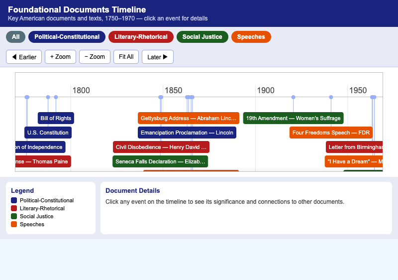

    Explore the chronological relationships among key foundational documents and writings that shaped American intellectual and civic life, from 1776 to 1964.

-   **[American Literary Periods Timeline](./literary-periods-timeline/index.md)**

    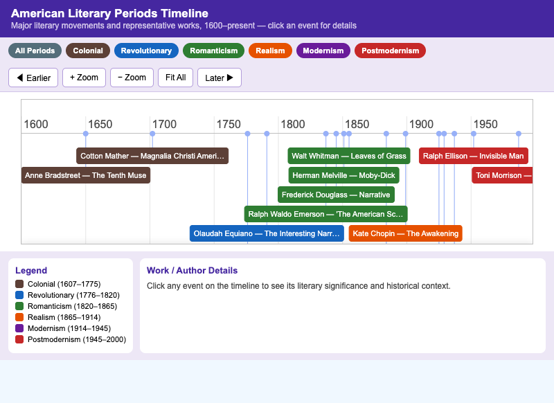

    Identify and contextualize the major American literary periods by locating representative works on an interactive timeline spanning the colonial era to postmodernism.

-   **[Argument Anatomy Explorer](./argument-anatomy-explorer/index.md)**

    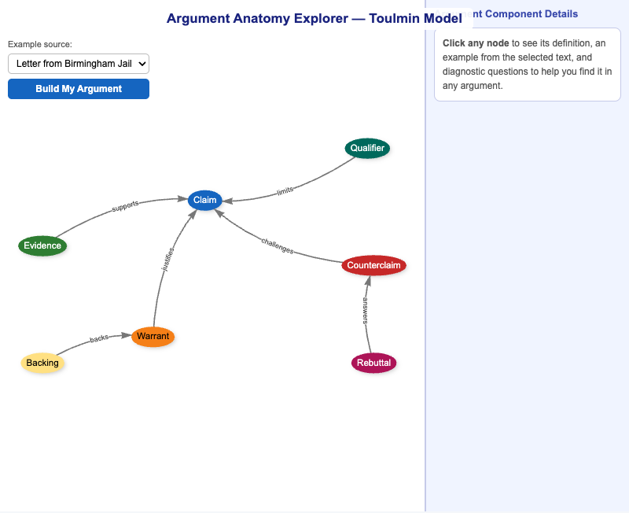

    Apply the Toulmin model to identify and label the components of a real argument — claim, evidence, warrant, backing, qualifier, counterclaim, and rebuttal — in three classic texts.

-   **[Causal Loop Diagram Explorer](./causal-loop-diagram-explorer/index.md)**

    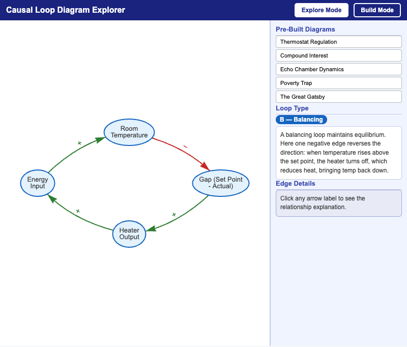

    Apply systems thinking by constructing and interpreting causal loop diagrams for real-world phenomena, identifying reinforcing and balancing feedback loops.

-   **[Cognitive Bias Spotter](./cognitive-bias-spotter/index.md)**

    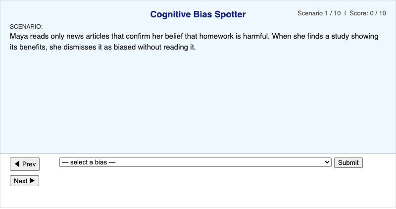

    Identify cognitive biases in realistic scenarios and develop strategies for recognizing them in everyday arguments and media.

-   **[Essay Architecture Explorer](./essay-architecture-explorer/index.md)**

    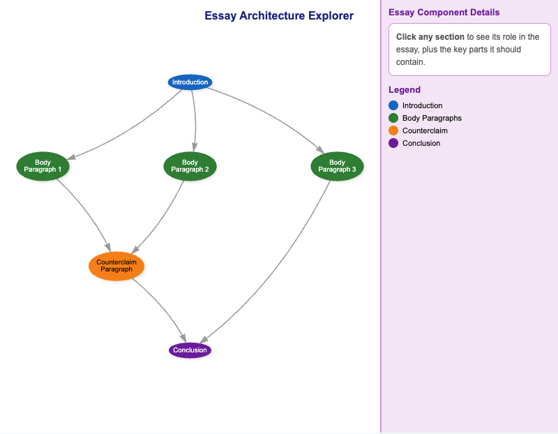

    Apply the structural conventions of argumentative essays by identifying and labeling the functional role of each paragraph — introduction, body, counterclaim, and conclusion.

-   **[Figurative Language Explorer](./figurative-language-explorer/index.md)**

    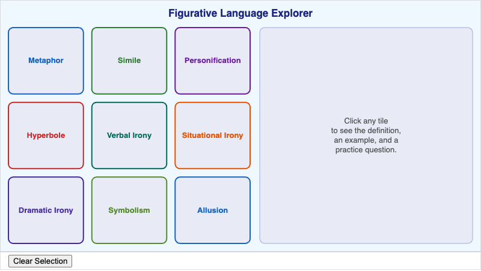

    Identify and distinguish nine major figures of speech — metaphor, simile, personification, hyperbole, verbal irony, situational irony, dramatic irony, symbolism, and allusion — with definitions, examples, and practice questions.

-   **[Five ELA Strands — Interactive Overview](./five-ela-strands/index.md)**

    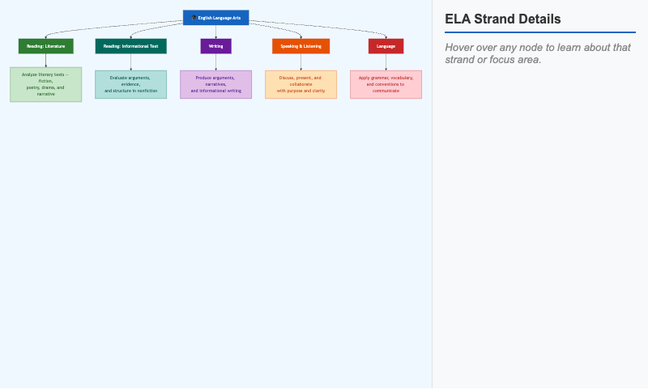

    Recall the five ELA strands and explore how reading, writing, speaking & listening, language, and research form an interconnected system.

-   **[Freytag's Pyramid — Plot Structure Explorer](./freytagpyramid-explorer/index.md)**

    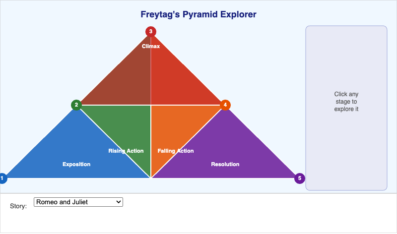

    Identify and apply the five stages of Freytag's Pyramid by locating the exposition, rising action, climax, falling action, and resolution in classic literary works.

-   **[Lexile Level Explorer](./lexile-level-explorer/index.md)**

    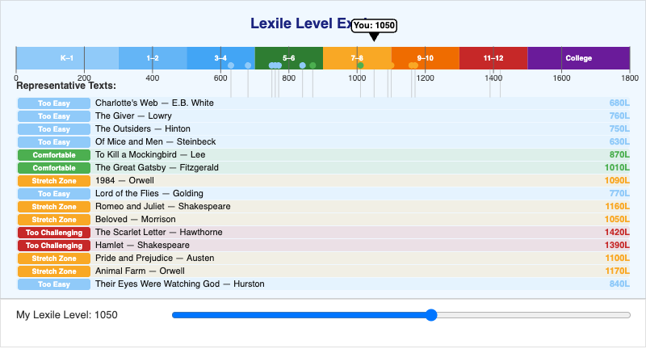

    Apply understanding of Lexile levels to identify appropriately challenging texts for a given reader profile and explore representative works across the full Lexile spectrum.

-   **[Literary Genre Landscape](./literary-genre-explorer/index.md)**

    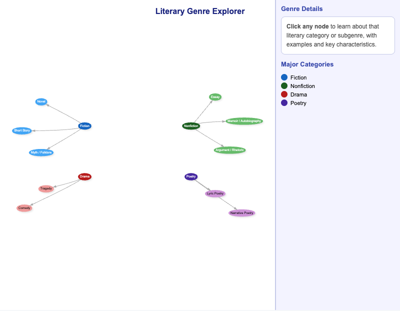

    Classify the four major literary categories — fiction, nonfiction, drama, and poetry — and their subgenres by exploring an interactive network diagram.

-   **[Logical Fallacy Navigator](./logical-fallacy-navigator/index.md)**

    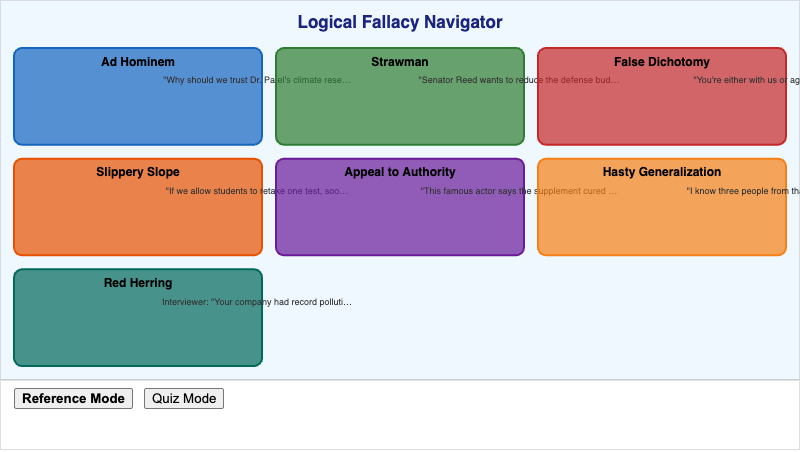

    Identify seven common logical fallacies in realistic argument scenarios and practice distinguishing valid reasoning from flawed rhetoric.

-   **[Narrative Time — Scene, Summary, and Flashback](./narrative-timeline-explorer/index.md)**

    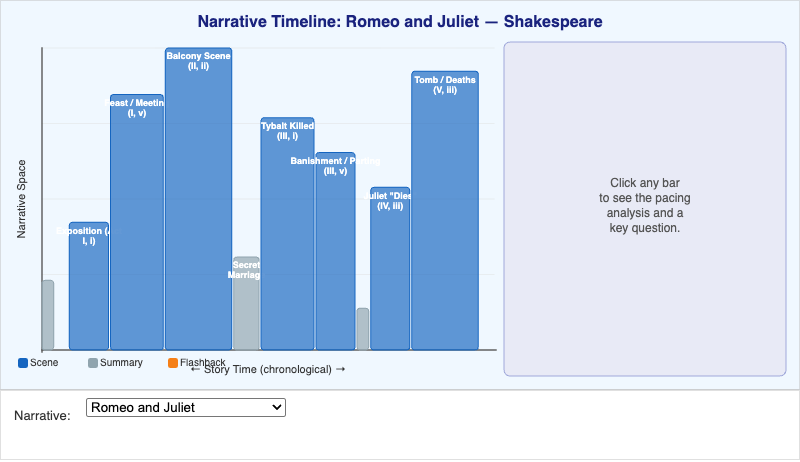

    Distinguish between scene, summary, and flashback as narrative techniques by mapping how authors manipulate story time versus narrative space in classic works.

-   **[Poetry Forms Comparison](./poetry-forms-explorer/index.md)**

    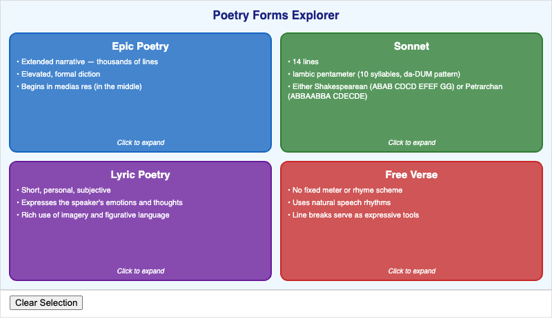

    Compare and contrast epic poetry, sonnets, lyric poetry, and free verse by examining their defining traits, representative examples, and structural conventions.

-   **[Research Writing Process](./research-process-explorer/index.md)**

    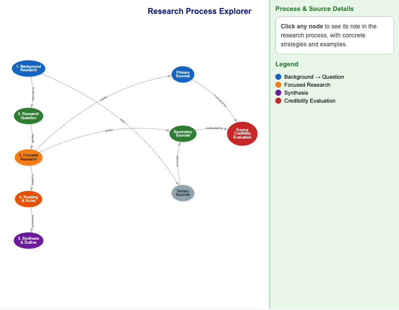

    Apply the research methodology framework by mapping a research project's phases — background research, focused inquiry, source evaluation, and synthesis — across primary, secondary, and tertiary sources.

-   **[Sentence Structure Analyzer](./sentence-structure-analyzer/index.md)**

    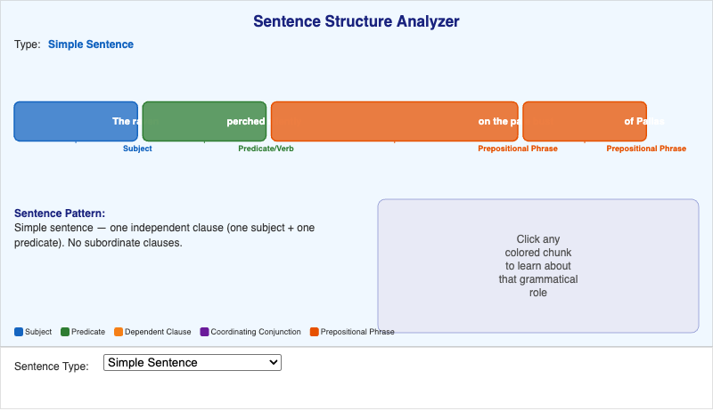

    Identify and label clause structure in simple, compound, complex, and compound-complex sentences — and participial phrases — by clicking on color-coded grammatical chunks.

-   **[Source Credibility Spectrum](./source-credibility-explorer/index.md)**

    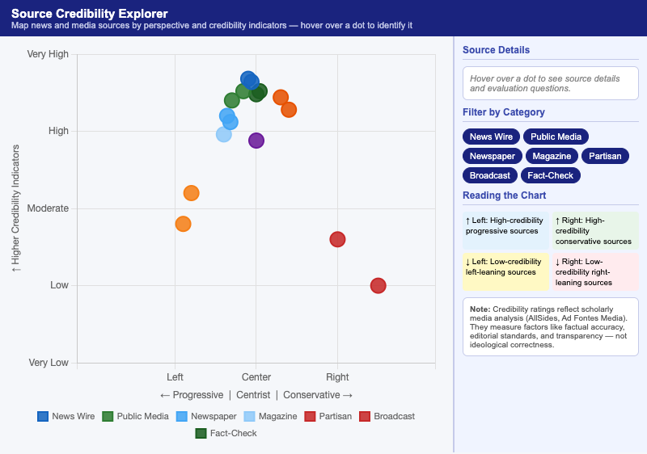

    Evaluate multiple news and media sources by mapping them on a two-axis chart of ideological perspective versus credibility indicators, with category filters and evaluation questions.

-   **[Vocabulary Morphology Explorer](./vocabulary-morphology-explorer/index.md)**

    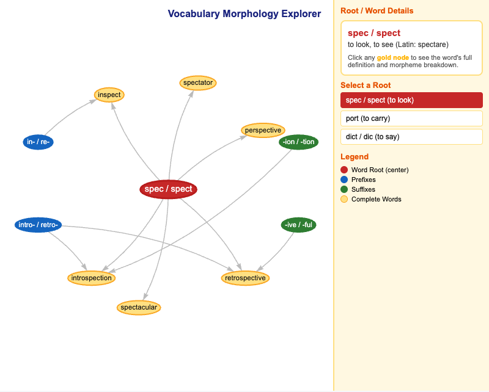

    Apply morphological analysis by identifying word roots, prefixes, and suffixes to infer the meanings of unfamiliar vocabulary using three Latin roots: spec/spect, port, and dict/dic.

